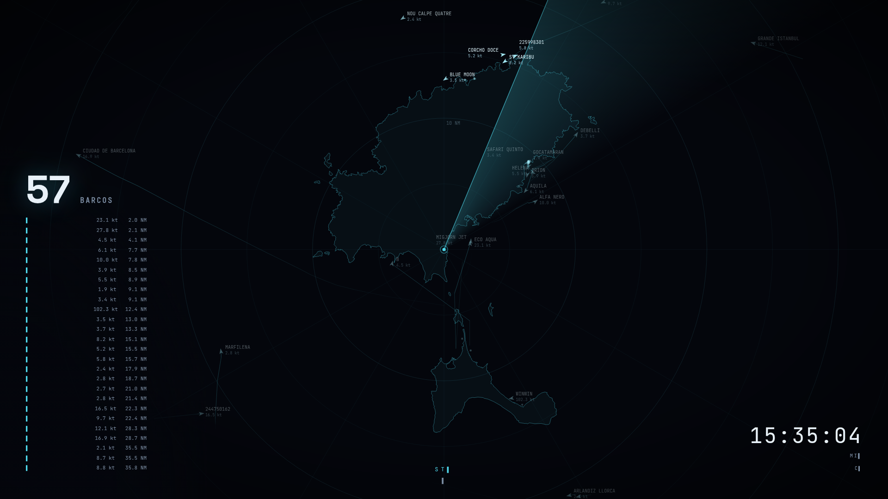

# AIS Radar Screensaver

A full-screen, ATC-style radar screensaver showing **real live ship traffic** received via
[aisstream.io](https://aisstream.io/)'s free AIS feed — with a rotating sweep, position trails,
non-overlapping labels, and numbers that roll like a cash register. **No receiver hardware
required**: unlike a typical ADS-B setup, you don't need an antenna or an SDR dongle — just a
free API key.



**Live demo (real traffic over Ibiza, right now):**
https://strato88.duckdns.org/ships/radar.html

[Versión en español →](README.es.md)

## What you need

- A free API key from [aisstream.io](https://aisstream.io/) (sign up, no payment, no hardware).
- Python 3 + the `websocket-client` package (`pip install -r requirements.txt`) — unlike the
  author's [ADS-B radar screensaver](https://github.com/strato88/stratostation-radar-screensaver),
  this server is **not** stdlib-only, since it needs a websocket client.
- A Mac or Windows PC for the screensaver itself.

## ⚠️ One key, one connection

**aisstream.io allows only one active websocket connection per API key.** Get your own free key
— do not reuse someone else's, including the key running the author's live demo above, or both
instances will silently fight over the single connection and one of them will keep disconnecting.

## Quick start

```bash
git clone https://github.com/strato88/stratostation-ais-screensaver.git
cd stratostation-ais-screensaver
pip install -r requirements.txt
```

1. **Configure the radar** — edit the `CONFIG` block at the top of the `<script>` in
   [radar.html](radar.html): your station's latitude/longitude, visible range, station label,
   locale, animation speeds. Everything is commented.

2. **Configure the server** — override with environment variables:

   | Variable | Default | Purpose |
   |---|---|---|
   | `AIS_PORT` | `8096` | HTTP port |
   | `AISSTREAM_KEY` | *(required)* | your free aisstream.io API key |
   | `AIS_LAT` | `38.8728` | station latitude |
   | `AIS_LON` | `1.4015` | station longitude |
   | `AIS_RANGE_NM` | `25` | subscription radius, in nautical miles — also drives the aisstream.io bounding box |
   | `AIS_PRUNE_S` | `2400` | forget a ship after this many seconds of silence |
   | `AIS_TRAIL_MAX` | `60` | max trail points kept per ship |
   | `AIS_TRAIL_MIN_GAP_S` | `30` | minimum seconds between two trail points |

3. **Run it**:

   ```bash
   AISSTREAM_KEY=your_key_here python3 server.py
   ```

   Open `http://<host>:8096/radar.html` in a browser to check it works.
   To run it permanently, see [examples/ais-radar.service](examples/ais-radar.service).

4. **(Optional) expose it through your reverse proxy / dynamic DNS** if you want the screensaver
   to work outside your LAN. `/api/ships` only re-serves position data that ships already
   broadcast in the clear over VHF, but review what you expose as with any service.

## Optional: coastline overlay

Drop a `coast.json` file next to `server.py` and the radar will draw it as a coastline overlay —
a JSON array of polylines, each a list of `[lon, lat]` points. The live demo's own `coast.json`
(Ibiza & Formentera) was built from OpenStreetMap via the Overpass API, simplified with the
Douglas-Peucker algorithm. This is entirely optional — with no `coast.json` present, the server
simply doesn't advertise that route and the radar draws without a coastline.

## Install the screensaver

### macOS — quick install (prebuilt, no setup)

Download **[AIS-Radar-Screensaver-macOS.zip](https://github.com/strato88/stratostation-ais-screensaver/releases/download/macos-v1.0/AIS-Radar-Screensaver-macOS.zip)**,
unzip it and double-click `AIS Radar.saver` — macOS will offer to install it. It comes preloaded
with the live Ibiza feed, and you can point it at your own server from **Options**. Since it is
not notarized by Apple, if Gatekeeper blocks it go to **System Settings → Privacy & Security**
and click **Open Anyway**.

### macOS — manual setup (generic loader)

1. Download [WebViewScreenSaver](https://github.com/liquidx/webviewscreensaver/releases)
   (free, open source) and double-click `WebViewScreenSaver.saver` to install.
   If Gatekeeper complains, allow it under **System Settings → Privacy & Security**.
2. **System Settings → Wallpaper → Screen Saver** → select **WebViewScreenSaver** → **Options**:
   - Untick *Fetch URLs Remotely*.
   - In **Addresses**, remove the sample URL and add yours:
     `http://<host>:8096/radar.html` (or your public HTTPS URL).
   - Set *Seconds* to a large value (e.g. `999999`) — the page refreshes its own data.
3. Multiple displays: enable **"Show on all displays"** next to the preview.

### Windows

1. Install [Lively Wallpaper](https://rocksdanister.github.io/lively/) (free, open source) —
   use the **installer** version, not the Microsoft Store one, so the screensaver runs without
   the app open.
2. In Lively: **+** → **Webpage/URL** tab → paste your radar URL.
3. Lively settings (gear) → **Screensaver** tab → enable using the current wallpaper as
   screensaver. Optionally install Lively's `.scr` from the same tab to pick it from the native
   Windows screensaver dialog.

## How it works

- `server.py` (~190 lines) keeps one persistent websocket connection to aisstream.io, accumulates
  ship state by MMSI (position, speed, course, heading, name, type, destination), builds a
  position trail per ship, prunes ships that go silent, and re-serves the current state as JSON
  at `/api/ships`.
- `radar.html` is a single self-contained page: a `<canvas>` renders range rings, sweep, trails
  and blips at 60 fps, plus an optional coastline; data refreshes every 5 s. Blip labels get
  placed by a small collision solver that spirals outwards until it finds free space. Ships
  underway (speed ≥ 0.5 kt) show as rotated triangles with name/speed labels; moored or anchored
  ships show as plain dots with no label, to keep busy harbours readable.
- Fonts ([Space Grotesk](https://github.com/floriankarsten/space-grotesk),
  [JetBrains Mono](https://github.com/JetBrains/JetBrainsMono)) are bundled in `vendor/` under
  the SIL Open Font License so the page works with no external requests.

## License

[MIT](LICENSE). Fonts under the [SIL OFL 1.1](vendor/FONT-LICENSES.md).
